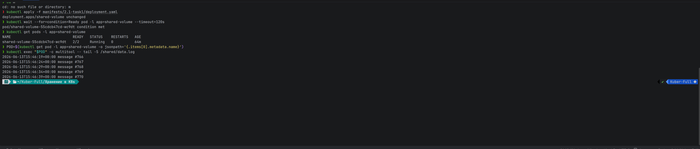
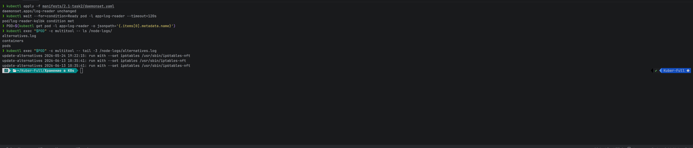
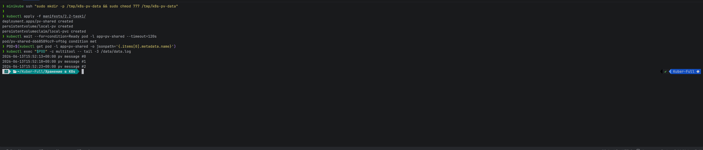
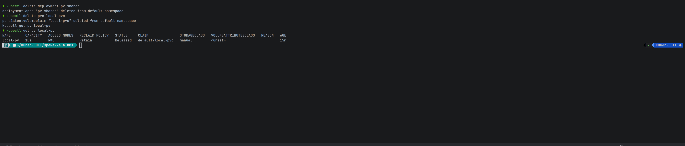
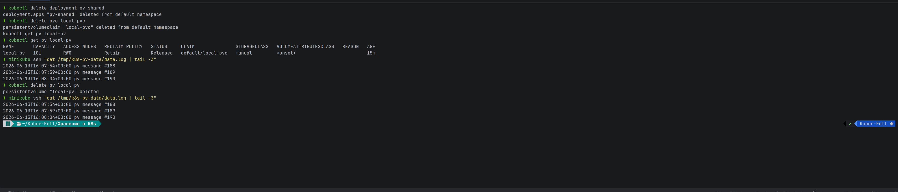
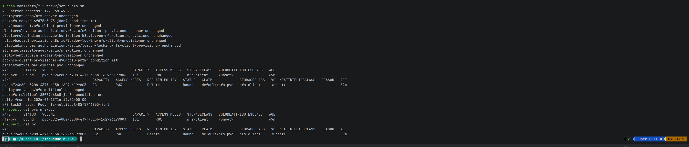
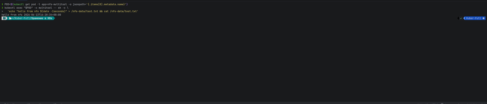
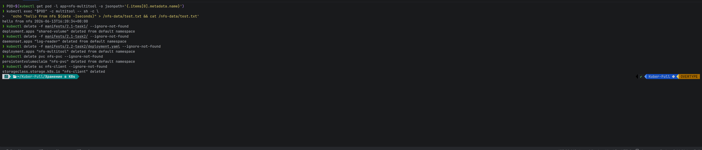

# Домашнее задание — «Хранение в K8s»

Среда: **minikube**, namespace `default`.

---

## Часть 1. Обмен файлами и логи ноды

### Задание 1. busybox + multitool (emptyDir)

Общий том `emptyDir`: busybox пишет в `/shared/data.log` каждые 5 секунд, multitool читает.

| Файл | Назначение |
|------|------------|
| [deployment.yaml](manifests/2.1-task1/deployment.yaml) | Deployment busybox + multitool |

```bash
# Создать Deployment с busybox и multitool из манифеста
kubectl apply -f manifests/2.1-task1/deployment.yaml

# Дождаться, пока Pod станет Ready (оба контейнера запустятся)
kubectl wait --for=condition=Ready pod -l app=shared-volume --timeout=120s

# Показать статус Pod (должно быть 2/2 Running)
kubectl get pods -l app=shared-volume

# Сохранить имя Pod в переменную, чтобы не вводить его вручную
POD=$(kubectl get pod -l app=shared-volume -o jsonpath='{.items[0].metadata.name}')

# Прочитать последние 5 строк общего файла из контейнера multitool
kubectl exec "$POD" -c multitool -- tail -5 /shared/data.log
```
  


### Задание 2. DaemonSet — логи ноды

| Файл | Назначение |
|------|------------|
| [daemonset.yaml](manifests/2.1-task2/daemonset.yaml) | DaemonSet log-reader |

> В MicroK8s: `/var/log/syslog`. В minikube читаем `/var/log/alternatives.log`.

```bash
# Создать DaemonSet, который монтирует /var/log ноды в Pod
kubectl apply -f manifests/2.1-task2/daemonset.yaml

# Дождаться запуска Pod DaemonSet на ноде
kubectl wait --for=condition=Ready pod -l app=log-reader --timeout=120s

# Сохранить имя Pod log-reader
POD=$(kubectl get pod -l app=log-reader -o jsonpath='{.items[0].metadata.name}')

# Показать список файлов логов, смонтированных с ноды
kubectl exec "$POD" -c multitool -- ls /node-logs/

# Прочитать последние строки лог-файла ноды
kubectl exec "$POD" -c multitool -- tail -3 /node-logs/alternatives.log
```

  


---

## Часть 2. PV и NFS

### Задание 1. Локальный PV (hostPath)

| Файл | Назначение |
|------|------------|
| [pv.yaml](manifests/2.2-task1/pv.yaml) | PV `Retain`, hostPath |
| [pvc.yaml](manifests/2.2-task1/pvc.yaml) | PVC |
| [deployment.yaml](manifests/2.2-task1/deployment.yaml) | busybox + multitool |

```bash
# Создать на ноде minikube каталог для hostPath-тома
minikube ssh "sudo mkdir -p /tmp/k8s-pv-data && sudo chmod 777 /tmp/k8s-pv-data"

# Применить PV, PVC и Deployment
kubectl apply -f manifests/2.2-task1/

# Дождаться запуска Pod с подключённым томом
kubectl wait --for=condition=Ready pod -l app=pv-shared --timeout=120s

# Сохранить имя Pod
POD=$(kubectl get pod -l app=pv-shared -o jsonpath='{.items[0].metadata.name}')

# Проверить, что multitool читает файл, который пишет busybox
kubectl exec "$POD" -c multitool -- tail -3 /data/data.log
```
  

После удаления Deployment и PVC:

```bash
# Удалить Deployment — Pod исчезнет, том отмонтируется
kubectl delete deployment pv-shared

# Удалить заявку на том (PVC)
kubectl delete pvc local-pvc

# Посмотреть, что стало с PV (ожидается статус Released)
kubectl get pv local-pv
```

  

**Почему `Released`:** `reclaimPolicy: Retain` — PV не удаляется вместе с PVC.

```bash
# Проверить, что файл остался на диске ноды после удаления PVC
minikube ssh "cat /tmp/k8s-pv-data/data.log | tail -3"

# Удалить объект PV из Kubernetes
kubectl delete pv local-pv

# Убедиться, что файл на диске ноды всё ещё существует
minikube ssh "cat /tmp/k8s-pv-data/data.log | tail -3"
```

Файл **остаётся на диске ноды** — PV описывал только точку монтирования.

  


### Задание 2. NFS с динамическим PV

| Файл | Назначение |
|------|------------|
| [nfs-server.yaml](manifests/2.2-task2/nfs-server.yaml) | NFS-сервер |
| [nfs-provisioner.yaml.tpl](manifests/2.2-task2/nfs-provisioner.yaml.tpl) | StorageClass + provisioner |
| [setup-nfs.sh](manifests/2.2-task2/setup-nfs.sh) | развёртывание |
| [pvc.yaml](manifests/2.2-task2/pvc.yaml) | PVC |
| [deployment.yaml](manifests/2.2-task2/deployment.yaml) | multitool |

```bash
# Развернуть NFS-сервер, provisioner, PVC и Deployment одним скриптом
bash manifests/2.2-task2/setup-nfs.sh

# Проверить, что PVC привязался к динамически созданному PV
kubectl get pvc nfs-pvc

# Показать автоматически созданный PersistentVolume
kubectl get pv
```

  

```bash
# Сохранить имя Pod с NFS-томом
POD=$(kubectl get pod -l app=nfs-multitool -o jsonpath='{.items[0].metadata.name}')

# Записать файл на NFS и сразу прочитать его — проверка R/W
kubectl exec "$POD" -c multitool -- sh -c \
  'echo "hello from nfs $(date -Iseconds)" > /nfs-data/test.txt && cat /nfs-data/test.txt'
```

  


---

## Очистка

```bash
# Удалить Deployment busybox + multitool (emptyDir)
kubectl delete -f manifests/2.1-task1/ --ignore-not-found

# Удалить DaemonSet log-reader
kubectl delete -f manifests/2.1-task2/ --ignore-not-found

# Удалить Deployment multitool с NFS-томом
kubectl delete -f manifests/2.2-task2/deployment.yaml --ignore-not-found

# Удалить PVC (PV удалится автоматически, т.к. reclaimPolicy: Delete)
kubectl delete pvc nfs-pvc --ignore-not-found

# Удалить NFS provisioner и NFS-сервер
kubectl delete deployment nfs-client-provisioner nfs-server --ignore-not-found

# Удалить StorageClass для NFS
kubectl delete sc nfs-client --ignore-not-found
```
  
