# Домашнее задание — «Настройка приложений и управление доступом в Kubernetes»

Среда: **minikube** (driver: docker), namespace `default`.

## Схема


---

## Задание 1. Nginx + Multitool + ConfigMap

### Проблема

При размещении **nginx** и **multitool** в одном Pod оба контейнера пытаются занять порт **80** (multitool внутри тоже запускает nginx). В логах multitool:

```
nginx: [emerg] bind() to 0.0.0.0:80 failed (98: Address in use)
```

Манифест с ошибкой: [manifests/task1/deployment-broken.yaml](manifests/task1/deployment-broken.yaml)

### Решение через ConfigMap

ConfigMap хранит альтернативные порты для multitool, Deployment читает их через `configMapKeyRef`:

| Файл | Назначение |
|------|------------|
| [configmap-multitool-ports.yaml](manifests/task1/configmap-multitool-ports.yaml) | `HTTP_PORT=8080`, `HTTPS_PORT=8443` |
| [configmap-nginx-html.yaml](manifests/task1/configmap-nginx-html.yaml) | веб-страница для nginx |
| [deployment.yaml](manifests/task1/deployment.yaml) | исправленный Deployment |
| [service.yaml](manifests/task1/service.yaml) | NodePort Service |

### Развёртывание

```bash
kubectl apply -f manifests/task1/configmap-multitool-ports.yaml
kubectl apply -f manifests/task1/configmap-nginx-html.yaml
kubectl apply -f manifests/task1/deployment.yaml
kubectl apply -f manifests/task1/service.yaml
```

### Проверка

```bash
kubectl get pods -l app=nginx-multitool
```
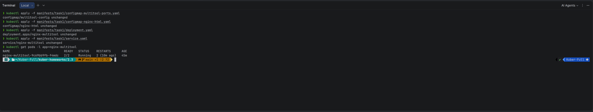


проверка, что multitool в Pod запустился нормально после исправления через ConfigMap

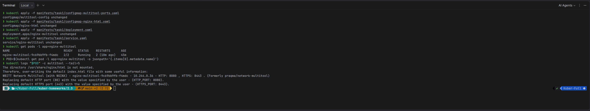  

проверка изнутри Pod, что multitool реально отвечает на своём порту.
```bash
kubectl exec "$POD" -c multitool -- curl -s http://127.0.0.1:8080/ | head -1
```
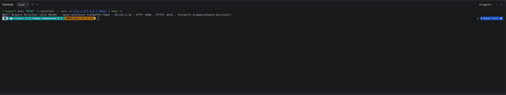
  
проверка веб-страницы снаружи Pod — через Service и minikube.
```bash
MINIKUBE_IP=$(minikube ip)
NODEPORT=$(kubectl get svc nginx-multitool -o jsonpath='{.spec.ports[0].nodePort}')
curl -s "http://${MINIKUBE_IP}:${NODEPORT}/"
```
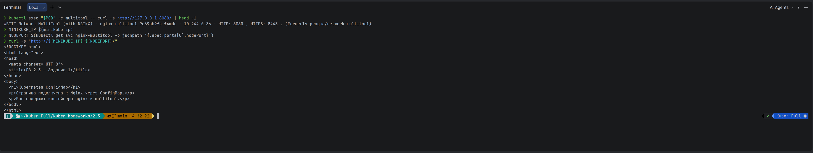  


Оба контейнера работают (`2/2 Ready`), nginx отдаёт страницу из ConfigMap.

---

## Задание 2. HTTPS через Ingress и TLS Secret

### Манифесты

| Файл | Назначение |
|------|------------|
| [configmap-nginx-html.yaml](manifests/task2/configmap-nginx-html.yaml) | веб-страница |
| [generate-tls.sh](manifests/task2/generate-tls.sh) | генерация самоподписного сертификата |
| [secret-tls.yaml](manifests/task2/secret-tls.yaml) | Secret типа `kubernetes.io/tls` |
| [deployment.yaml](manifests/task2/deployment.yaml) | Deployment nginx |
| [service.yaml](manifests/task2/service.yaml) | ClusterIP Service |
| [ingress.yaml](manifests/task2/ingress.yaml) | Ingress с TLS |

### Подготовка TLS
создаёт manifests/task2/secret-tls.yaml и certs/tls.{crt,key}
```bash
bash manifests/task2/generate-tls.sh

```
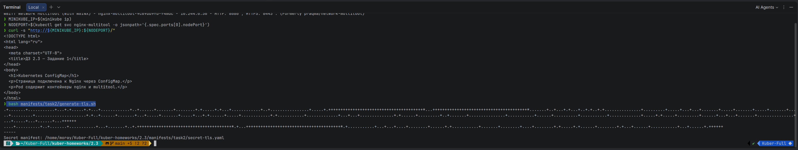
### Развёртывание
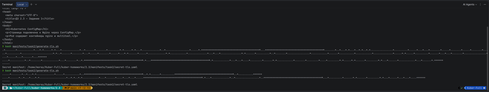
```bash
minikube addons enable ingress
kubectl apply -f manifests/task2/
```

### Проверка HTTPS

```bash
MINIKUBE_IP=$(minikube ip)
curl -sk --resolve nginx.local:443:${MINIKUBE_IP} https://nginx.local/
```
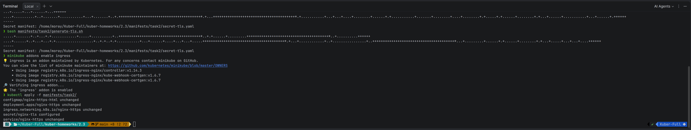
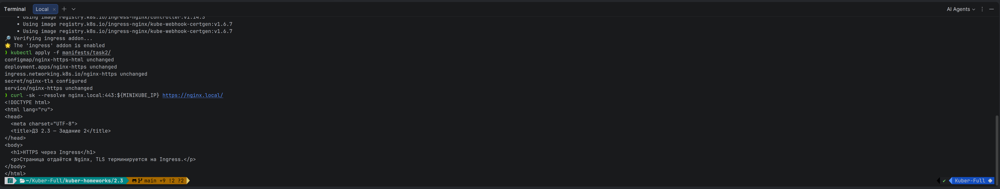    
проверка HTTPS-доступа к приложению через Ingress   
```bash
curl -skv --resolve nginx.local:443:${MINIKUBE_IP} https://nginx.local/ 2>&1 | grep -E 'subject:|HTTP/|SSL'
```
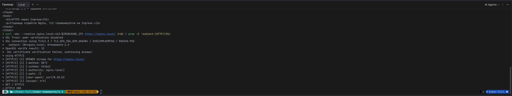  


Ingress терминирует TLS с Secret `nginx-tls`, backend nginx работает по HTTP внутри кластера.

---

## Задание 3. RBAC — пользователь developer

В **minikube** RBAC включён по умолчанию (в MicroK8s: `microk8s enable rbac`).

### Манифесты

| Файл | Назначение |
|------|------------|
| [role-pod-reader.yaml](manifests/task3/role-pod-reader.yaml) | Role: просмотр подов и логов |
| [rolebinding-developer.yaml](manifests/task3/rolebinding-developer.yaml) | привязка роли к пользователю `developer` |
| [generate-developer-cert.sh](manifests/task3/generate-developer-cert.sh) | генерация клиентского сертификата |

### Генерация сертификата пользователя

```bash
openssl genrsa -out developer.key 2048
openssl req -new -key developer.key -out developer.csr -subj "/CN=developer"
openssl x509 -req -in developer.csr \
  -CA ~/.minikube/ca.crt -CAkey ~/.minikube/ca.key -CAcreateserial \
  -out developer.crt -days 365
```  
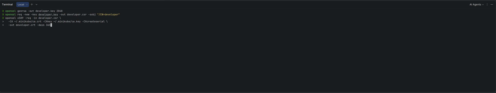  

создали клиентский SSL-сертификат для пользователя Kubernetes developer — это его «удостоверение личности» при подключении к кластеру.  
```bash
bash manifests/task3/generate-developer-cert.sh developer
```
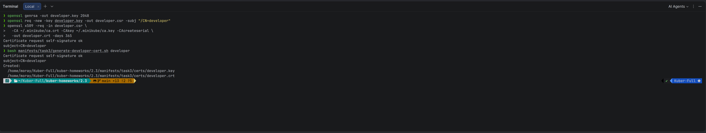 
### Развёртывание RBAC

```bash
kubectl apply -f manifests/task3/role-pod-reader.yaml
kubectl apply -f manifests/task3/rolebinding-developer.yaml
```
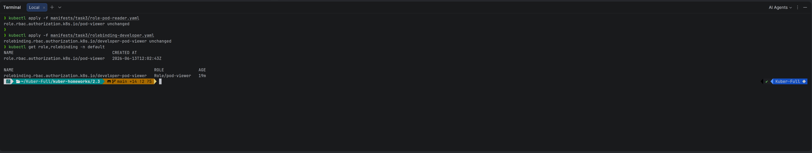  
### Проверка прав

```bash
kubectl auth can-i get pods --as=developer
kubectl auth can-i get pods/log --as=developer
kubectl auth can-i create pods --as=developer

kubectl get pods --as=developer
kubectl logs hello-world --as=developer --tail=3
kubectl describe pod hello-world --as=developer
```  
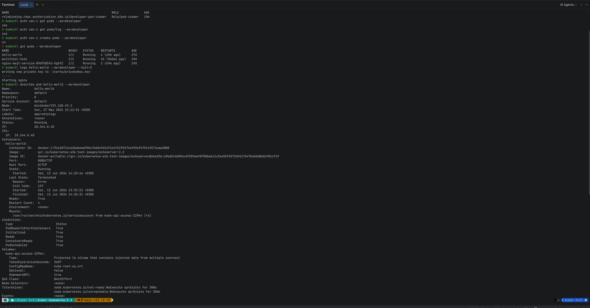  


## Очистка

```bash
kubectl delete -f manifests/task1/ --ignore-not-found
kubectl delete -f manifests/task2/ --ignore-not-found
kubectl delete -f manifests/task3/ --ignore-not-found
```
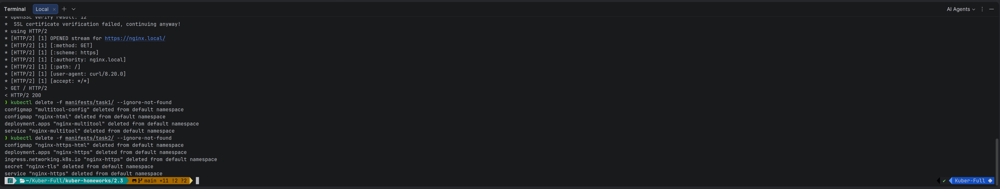
  
