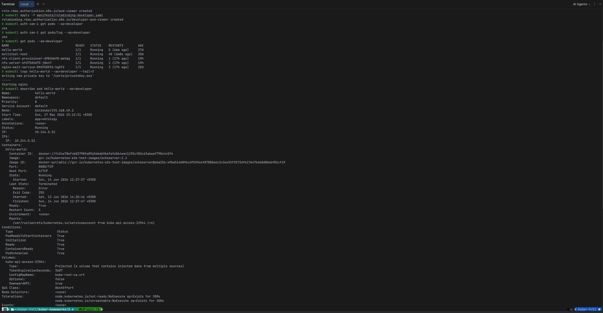

# Домашнее задание — «Управление доступом»

Среда: **minikube**, namespace `default`.

---

## Задание 1. RBAC — пользователь developer

Пользователь `developer` может просматривать поды, логи и описание (`get`, `list`, `watch` на pods; `get` на pods/log).

| Файл | Назначение |
|------|------------|
| [role-pod-reader.yaml](manifests/role-pod-reader.yaml) | Role |
| [rolebinding-developer.yaml](manifests/rolebinding-developer.yaml) | RoleBinding |
| [generate-developer-cert.sh](manifests/generate-developer-cert.sh) | генерация сертификата |

### Генерация сертификата

```bash
# Создать закрытый ключ
openssl genrsa -out developer.key 2048

# Создать запрос на сертификат (CN=developer — имя пользователя в K8s)
openssl req -new -key developer.key -out developer.csr -subj "/CN=developer"

# Подписать сертификат CA minikube
openssl x509 -req -in developer.csr \
  -CA ~/.minikube/ca.crt -CAkey ~/.minikube/ca.key -CAcreateserial \
  -out developer.crt -days 365
```

Или скриптом:

```bash
bash manifests/generate-developer-cert.sh developer
```

### Развёртывание RBAC

```bash
# Применить Role и RoleBinding
kubectl apply -f manifests/role-pod-reader.yaml
kubectl apply -f manifests/rolebinding-developer.yaml
```

### Проверка прав

```bash
# Проверить, какие действия разрешены пользователю developer
kubectl auth can-i get pods --as=developer
kubectl auth can-i get pods/log --as=developer
kubectl auth can-i create pods --as=developer

# Список подов от имени developer
kubectl get pods --as=developer

# Логи и описание пода
kubectl logs hello-world --as=developer --tail=3
kubectl describe pod hello-world --as=developer
```

<!-- скриншоты -->

---

## Очистка

```bash
kubectl delete -f manifests/role-pod-reader.yaml
kubectl delete -f manifests/rolebinding-developer.yaml
```

##  «Задание 2»


