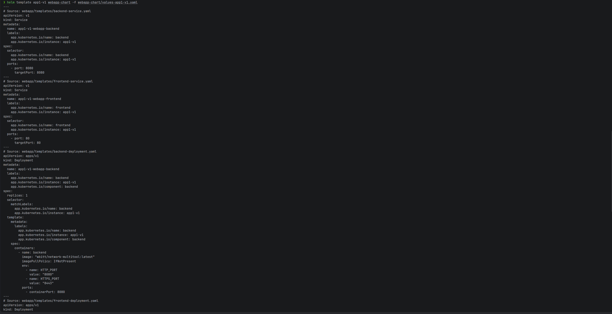
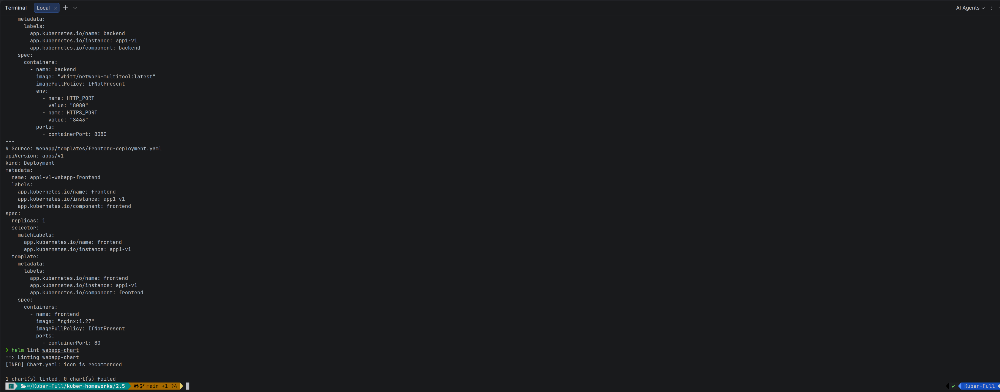
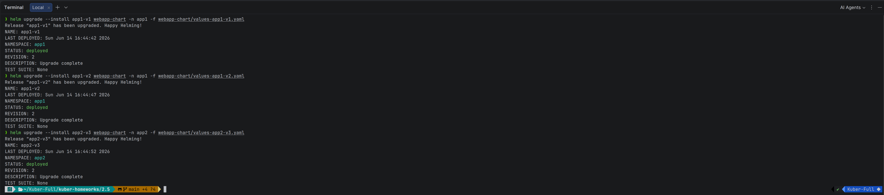
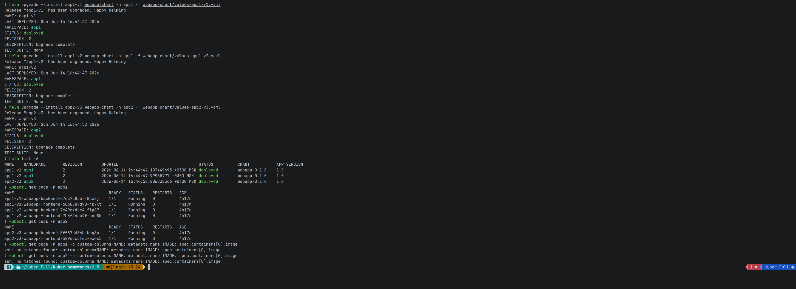
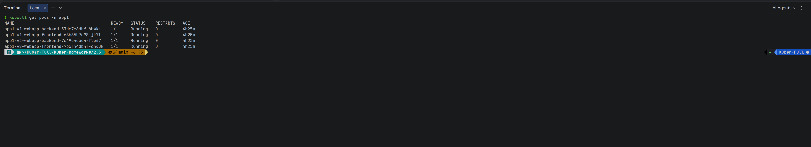
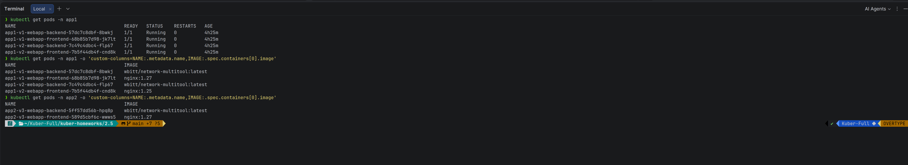

# Домашнее задание к занятию «Helm»

Среда: **minikube**, Helm **v4.1.4**, namespace `app1` / `app2`.

Приложение: **frontend** (nginx) + **backend** (multitool) — каждый компонент в отдельном Deployment.

---

## Задание 1. Helm-чарт

| Файл | Назначение |
|------|------------|
| [webapp-chart/Chart.yaml](webapp-chart/Chart.yaml) | метаданные чарта |
| [webapp-chart/values.yaml](webapp-chart/values.yaml) | переменные по умолчанию |
| [webapp-chart/templates/frontend-deployment.yaml](webapp-chart/templates/frontend-deployment.yaml) | Deployment frontend |
| [webapp-chart/templates/backend-deployment.yaml](webapp-chart/templates/backend-deployment.yaml) | Deployment backend |
| [webapp-chart/templates/frontend-service.yaml](webapp-chart/templates/frontend-service.yaml) | Service frontend |
| [webapp-chart/templates/backend-service.yaml](webapp-chart/templates/backend-service.yaml) | Service backend |

Версия образа меняется через values:

```yaml
frontend:
  image:
    repository: nginx
    tag: "1.27"    # ← меняем tag для другой версии
backend:
  image:
    repository: wbitt/network-multitool
    tag: latest
```

Файлы values для разных окружений:
- [values-app1-v1.yaml](webapp-chart/values-app1-v1.yaml) — nginx `1.27`
- [values-app1-v2.yaml](webapp-chart/values-app1-v2.yaml) — nginx `1.25`
- [values-app2-v3.yaml](webapp-chart/values-app2-v3.yaml) — nginx `1.27`

### Проверка чарта

```bash
# Проверить синтаксис и структуру чарта
helm lint webapp-chart

# Посмотреть сгенерированные манифесты без установки в кластер
helm template app1-v1 webapp-chart -f webapp-chart/values-app1-v1.yaml
```

```
1 chart(s) linted, 0 chart(s) failed
```


---

## Задание 2. Три версии в namespace app1 и app2

| Релиз | Namespace | Values | Образ frontend |
|-------|-----------|--------|----------------|
| `app1-v1` | app1 | values-app1-v1.yaml | nginx:1.27 |
| `app1-v2` | app1 | values-app1-v2.yaml | nginx:1.25 |
| `app2-v3` | app2 | values-app2-v3.yaml | nginx:1.27 |

### Развёртывание

```bash
# Создать namespace app1 и app2
kubectl create namespace app1
kubectl create namespace app2

# Первая версия в app1 (nginx 1.27)
helm upgrade --install app1-v1 webapp-chart -n app1 -f webapp-chart/values-app1-v1.yaml

# Вторая версия в том же namespace app1 (nginx 1.25)
helm upgrade --install app1-v2 webapp-chart -n app1 -f webapp-chart/values-app1-v2.yaml

# Третья версия в namespace app2
helm upgrade --install app2-v3 webapp-chart -n app2 -f webapp-chart/values-app2-v3.yaml
```



### Проверка

```bash
# Список всех Helm-релизов
helm list -A

# Pod'ы в app1 (два релиза = 4 Pod'а)
kubectl get pods -n app1

# Pod'ы в app2
kubectl get pods -n app2

# Проверить версии образов
kubectl get pods -n app1 -o custom-columns=NAME:.metadata.name,IMAGE:.spec.containers[0].image
kubectl get pods -n app2 -o custom-columns=NAME:.metadata.name,IMAGE:.spec.containers[0].image
```





В namespace **app1** работают **две разные версии** frontend (1.27 и 1.25).

---

## Очистка

```bash
helm uninstall app1-v1 -n app1
helm uninstall app1-v2 -n app1
helm uninstall app2-v3 -n app2
kubectl delete namespace app1 app2
```
