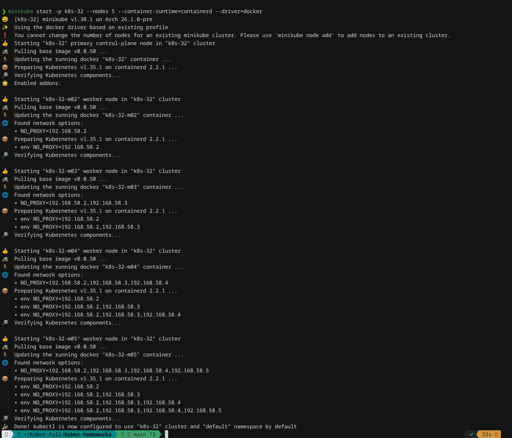
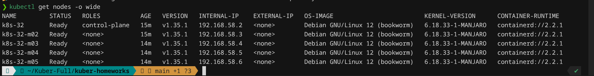
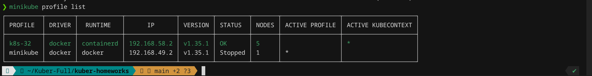
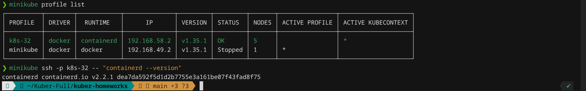
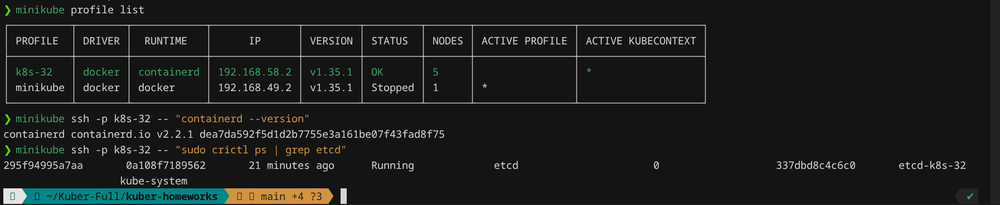
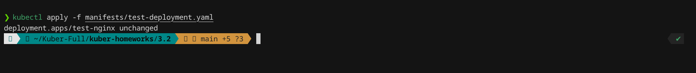
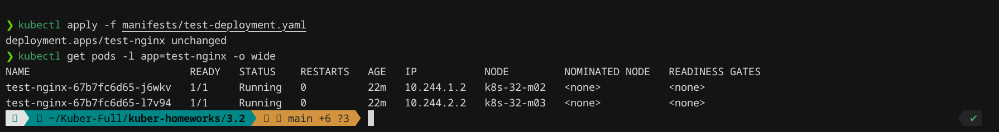

# Домашнее задание к занятию «Установка Kubernetes»

**Хост:** Manjaro Linux  
**Способ установки:** [minikube](https://minikube.sigs.k8s.io/) (multi-node, внутри — **kubeadm** + **containerd**)  
**Профиль кластера:** `k8s-32`

---

## Задание 1. Кластер: 1 master + 4 worker

| Требование | Реализация |
|------------|------------|
| 5 нод (1 master + 4 worker) | minikube `--nodes 5` |
| CRI — containerd | `--container-runtime=containerd` |
| etcd на master | Pod `etcd-k8s-32` на control-plane |
| Способ установки | minikube (на базе kubeadm) |

### Установка

```bash
# Запустить кластер: 1 control-plane + 4 worker, containerd
minikube start -p k8s-32 --nodes 5 --container-runtime=containerd --driver=docker
```

Или скриптом: [install-cluster.sh](install-cluster.sh)

```bash
bash install-cluster.sh
```




```bash
# Список всех 5 нод
kubectl get nodes -o wide
```


```bash
# Информация о профиле minikube
minikube profile list
```



### containerd

На каждой ноде runtime — **containerd 2.2.1** (видно в колонке `CONTAINER-RUNTIME`).

```bash
# Проверка containerd на master-ноде
minikube ssh -p k8s-32 -- "containerd --version"
```




### etcd на master

```bash
# etcd работает только на control-plane (k8s-32)
minikube ssh -p k8s-32 -- "sudo crictl ps | grep etcd"
```



### Проверка работоспособности кластера

Манифест: [manifests/test-deployment.yaml](manifests/test-deployment.yaml)

```bash
# Развернуть тестовое приложение
kubectl apply -f manifests/test-deployment.yaml

# Убедиться, что Pod'ы запустились
kubectl get pods -l app=test-nginx -o wide
```




---

## Схема кластера

```
Manjaro (хост)
└── minikube profile: k8s-32
    ├── k8s-32       — control-plane (master), etcd, containerd
    ├── k8s-32-m02   — worker, containerd
    ├── k8s-32-m03   — worker, containerd
    ├── k8s-32-m04   — worker, containerd
    └── k8s-32-m05   — worker, containerd
```

---

## Очистка

```bash
minikube delete -p k8s-32
```
